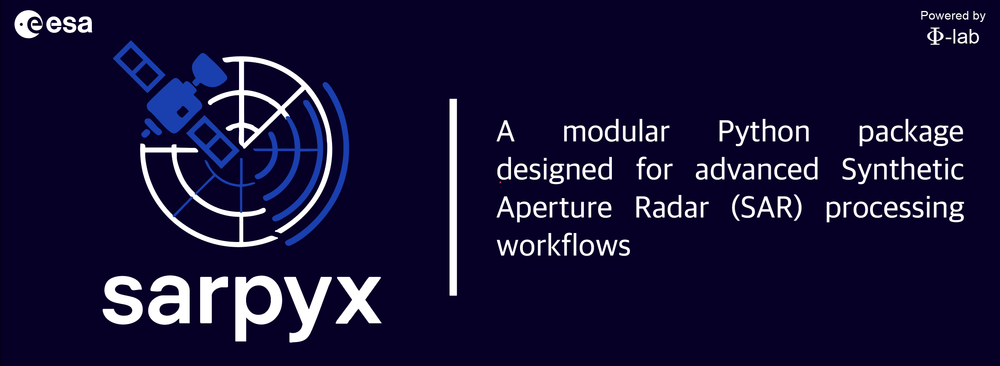

<div align="center">



<br />

<a href="docs/user_guide/README.md">
  
</a>
<a href="docs/user_guide/getting_started.md">
  
</a>
<a href="LICENSE">
  
</a>
<a href="https://github.com/ESA-PhiLab/sarpyx/releases/tag/v1.0.0">
  
</a>
</div>

##

**sarpyx** is a specialized Python toolkit for **Synthetic Aperture Radar (SAR)** processing with tight integration to ESA **SNAP**. It focuses on reproducible pipelines, fast tiling workflows, and advanced research features like **sub-aperture decomposition**.

## Documentation

- [Documentation site](https://esa-philab.github.io/sarpyx/)
- [Installation guide](docs/user_guide/installation.md)
- [CLI usage examples](docs/user_guide/cli_examples.md)
- [User guide](docs/user_guide/README.md)
- [API reference](docs/api/README.md)

## Quick Reference

<summary><strong>Using conda (preferred, avoids global SNAP installs)</strong></summary>

The recommended installation uses conda first to provide ESA SNAP and `gpt`, then installs `sarpyx` with `pip` from this checkout. This keeps SNAP/native dependencies isolated in the environment while keeping the Python package editable.

```bash
conda create -n sarpyx -c sirbastiano/label/dev -c conda-forge \
  python=3.12 pip snap13=13.0.0

conda activate sarpyx
python -m pip install -e .
```

Verify the installation:

```bash
gpt -h
sarpyx --help
sarpyx-pipeline --help
```

## Project Links

- [Contributing guide](CONTRIBUTING.md)
- [Security policy](SECURITY.md)
- [Citation metadata](CITATION.cff)
- [License](LICENSE)
